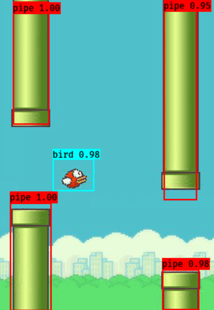

## 小鸟检测（yolov3） 
### 游戏
使用*pygame*开发的``flappy bird``[游戏](https://github.com/hehenihao/BirdsGame)
### 数据准备
1、玩游戏的时候自动生成有标注的训练数据。 
```python
python yolo_bird_gen.py
```
*yolo_bird_gen.py*中的配置项：  
- ``ANNOTATION_PIC`` 同时生成带有标注的图片数据（可查看标注框）
- ``SHOOTS`` 获取不同的数据量
- ``INTERVAL`` 截图间隔

生成结果：  
- ``Annotations``文件夹：类似VOC标注数据的XML文件
- ``AnnPics``文件夹： 标注框图片
- ``JPGs``文件夹： 原始数据

2、选取训练数据
```python
python split_data.py
```
3、转化yolo3格式
```python
python yolo3_annotation.py
```
当前文件夹生成*bird_train.txt*，截取部分数据
```
E:\00_git\Python3\test\JPGs\000000.jpg 75,130,123,178,0 229,285,281,414,1 229,2,281,176,1
E:\00_git\Python3\test\JPGs\000001.jpg 75,221,123,269,0 208,285,260,414,1 208,2,260,176,1
E:\00_git\Python3\test\JPGs\000003.jpg 75,207,123,255,0 166,285,218,414,1 166,2,218,176,1
E:\00_git\Python3\test\JPGs\000005.jpg 75,223,123,271,0 124,285,176,414,1 124,2,176,176,1
E:\00_git\Python3\test\JPGs\000006.jpg 75,195,123,243,0 103,285,155,414,1 103,2,155,176,1
E:\00_git\Python3\test\JPGs\000007.jpg 75,174,123,222,0 82,285,134,414,1 82,2,134,176,1
E:\00_git\Python3\test\JPGs\000009.jpg 75,197,123,245,0 40,285,92,414,1 40,2,92,176,1 240,241,286,414,1 240,2,286,132,1
```
4、训练
- 使用keras-yolo3[框架](https://github.com/qqwweee/keras-yolo3)
- 使用yolo3的预训练[权重](https://pjreddie.com/media/files/yolov3.weights)
- *yolov3_bird.cfg*
可以在配置文件中搜索``yolo``快速定位带需要更改配置的地方
```
pad=1
filters=21   # 3*(5 + class)
activation=linear


[yolo]
mask = 6,7,8
anchors = 10,13,  16,30,  33,23,  30,61,  62,45,  59,119,  116,90,  156,198,  373,326
classes=2  # bird pipe
num=9
jitter=.3
ignore_thresh = .5
truth_thresh = 1
random=0   # 显存小，关闭多维度训练
```
- 训练

复制*train.py*为*bird_train.py*，更改如下的地方：
```python
annotation_path = 'bird_train.txt'
log_dir = 'logs/bird/'
classes_path = 'model_data/bird_classes.txt'
anchors_path = 'model_data/yolo_anchors.txt'
class_names = get_classes(classes_path)
num_classes = len(class_names)
anchors = get_anchors(anchors_path)

input_shape = (416,288) # multiple of 32, hw
```
执行
```
python train_bird.py
```
等待训练完成。

5、测试
更改*yolo.py*如下：
```python
_defaults = {
    "model_path": 'logs/bird/trained_weights_final.h5',
    "anchors_path": 'model_data/yolo_anchors.txt',
    "classes_path": 'model_data/bird_classes.txt',
    "score" : 0.3,
    "iou" : 0.45,
    "model_image_size" : (416,288),
    "gpu_num" : 0,
}
```
由于电脑不带GPU，训练次数较少。执行
```python
python yolo_video.py --image
```
输入测试图片路径即可。效果图：



# TODOs
- 不使用预训练权重进行训练
- 提高辨识效果